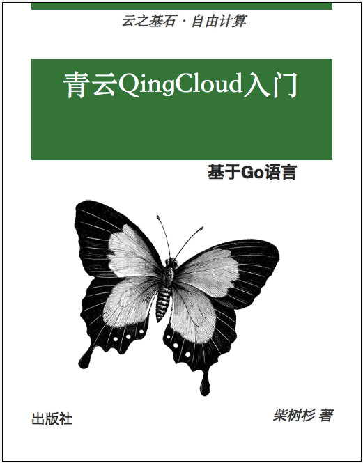

# 青云QingCloud云计算入门 - 基于Go语言

本书介绍了如何使用Go语言访问青云QingCloud云计算资源。对于刚学习Go语言的读者，建议先从[《Go语言圣经》](https://github.com/golang-china/gopl-zh)开始系统学习Go语言的基础知识。

- 作者：柴树杉，Github [@chai2010](https://github.com/chai2010)，Twitter [@chaishushan](https://twitter.com/chaishushan)
- 项目地址：https://github.com/chai2010/qingcloud-primer-book
- 在线阅读：https://chai2010.cn/qingcloud-primer-book/
- 青云文档：https://docs.qingcloud.com/

----

## 项目由来

来青云已经超过1年了，1年来学习到了以前不曾接触过的知识。最近也遇到了一些新的挑战，可能这就是新知识的门槛，需要自己迈过。为了避免被技术淘汰，为2019年设定一个小目标，写一本《青云QingCloud云计算入门 - 基于Go语言》。在战争中学习战争，这可能是最快的成长方式。

----

## 版权声明

自有版权，转载请联系作者。

